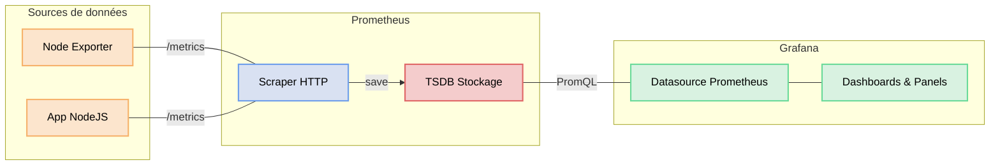

# Installation de Grafana

Prometheus collecte et stocke vos métriques, mais son interface reste limitée pour la visualisation. Grafana est l'outil qui transforme ces données brutes en dashboards clairs et lisibles. C'est le standard de l'industrie pour visualiser des métriques Prometheus.

## Comprendre la place de Grafana dans la stack

Grafana ne stocke aucune donnée. Il se connecte à des **sources de données** (datasources) comme Prometheus, Loki, InfluxDB, etc., et exécute des requêtes pour afficher les résultats sous forme de graphiques.



👉 Point clé :  
Grafana **ne remplace pas Prometheus**. Il le complète en rendant les données exploitables visuellement.

## Prérequis

Vous allez ajouter Grafana à votre stack de monitoring existante. Il vous faut donc :
- Prometheus en fonctionnement (vu dans le module précédent)
- Node Exporter actif sur votre serveur Ubuntu
- L'application NodeJS qui expose ses métriques

## Installation sur Docker

Ajoutez le service Grafana dans votre `docker-compose.yml` existant :

```yaml
  grafana:
    image: grafana/grafana:13.0.1
    container_name: grafana
    ports:
      - "3001:3000"                    # Grafana écoute sur 3000 en interne ; 3001 évite le conflit avec l'app NodeJS
    volumes:
      - grafana-data:/var/lib/grafana  # Stockage persistant : dashboards, datasources, utilisateurs
    environment:
      - GF_SECURITY_ADMIN_USER=admin   # Identifiant du compte administrateur initial
      - GF_SECURITY_ADMIN_PASSWORD=admin  # Mot de passe initial (à changer en production !)
    restart: unless-stopped
    networks:
      - monitoring                     # Même réseau que Prometheus pour pouvoir l'interroger par nom
```

Et ajoutez le volume dans la section `volumes` :

```yaml
volumes:
  prometheus-data:
  grafana-data:
```

Relancez la stack :

```bash
docker compose up -d
```

## Vérifier le fonctionnement

Grafana : 👉 http://localhost:3001

Connectez-vous avec les identifiants :
- Utilisateur : `admin`
- Mot de passe : `admin`

Grafana vous demandera de changer le mot de passe lors de la première connexion. Vous pouvez passer cette étape pour le lab.

## Connecter Prometheus comme datasource

Pour que Grafana puisse interroger Prometheus, il faut lui déclarer Prometheus comme source de données.

### 1. Accéder aux datasources

Dans le menu de gauche :  
👉 **Connections → Data sources → Add data source**

### 2. Choisir Prometheus

Sélectionnez **Prometheus** dans la liste.

### 3. Configurer la connexion

Remplissez les champs suivants :

| Champ | Valeur |
|-------|--------|
| Name | `Prometheus` |
| Prometheus server URL | `http://prometheus:9090` |

👉 On utilise `prometheus` (le nom du service Docker) et non `localhost`, car Grafana tourne dans le même réseau Docker que Prometheus.

### 4. Sauvegarder et tester

Cliquez sur **Save & test**.

Vous devez voir :  
✅ `Successfully queried the Prometheus API.`

## Résultat

Grafana est installé et connecté à Prometheus. Vous pouvez maintenant :
- créer des dashboards personnalisés
- importer des dashboards communautaires
- configurer des alertes visuelles
